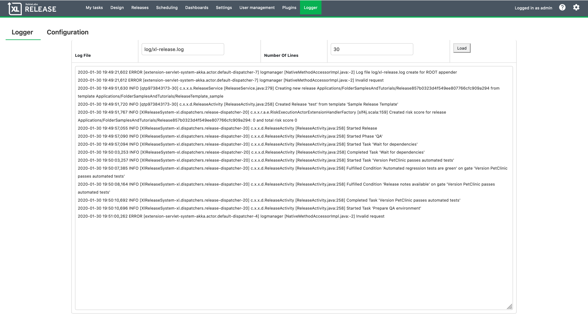
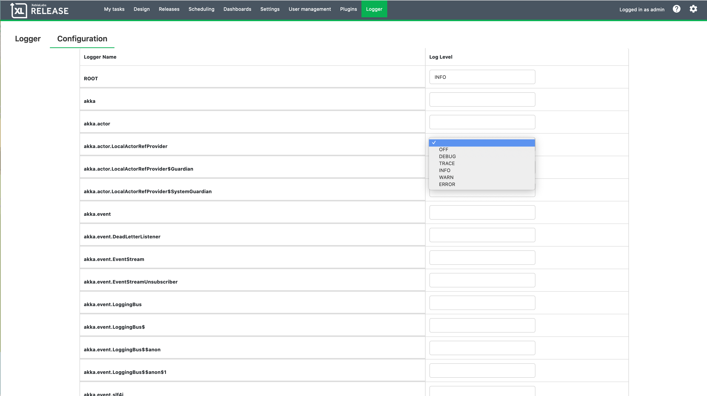

# XL Release Log Report Plugin

## Preface
This document describes the functionality provided by the 'xlr-logreport-plugin'

## Overview
This plugin allows you to manage running *Logback* logging levels from the XL Release UI.  You can change the log levels look at any log file in the UI and copy some of the log information to be shared with other teams without having shell access on the system.

## Installation
- Copy the plugin JAR into the *'SERVER_HOME/plugins'* directory of XL Release.

## GUI Usage
- By clicking on the new menu item for *Logger* you will see the current last `30` lines of the log `log/xl-release.log`.  You can request an update by clicking on the `Load` button.

- If you want to change any of the logging levels for any of the appenders click on the *Configuration* menu option.  Here you can change the logging level by clicking on the drop down.

## Resources:
1. https://stackoverflow.com/questions/16845067/dynamically-create-logback-loggers-and-appenders
1. https://stackoverflow.com/questions/44383850/adding-appender-dynamically-in-logback
1. https://stackoverflow.com/questions/16910955/programmatically-configure-logback-appender?noredirect=1
